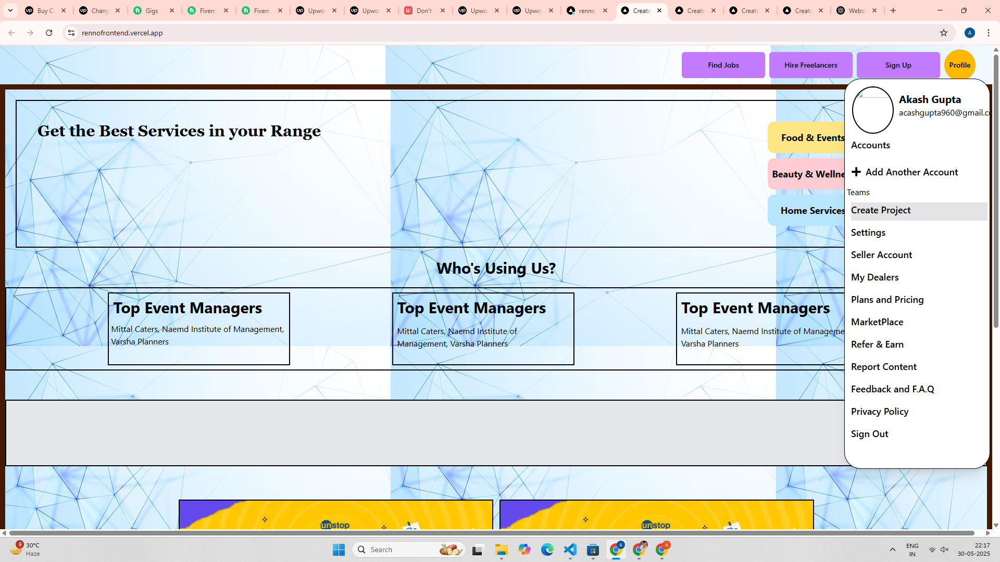
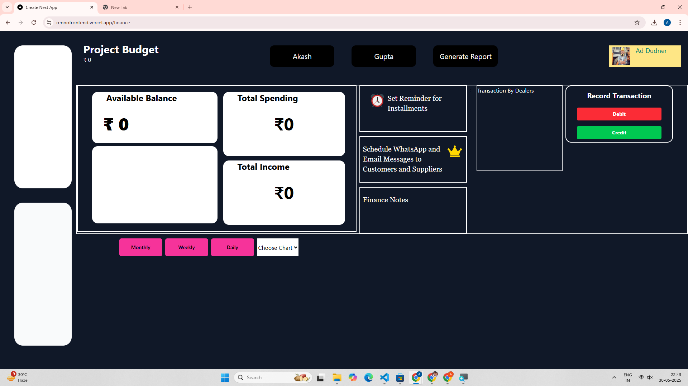
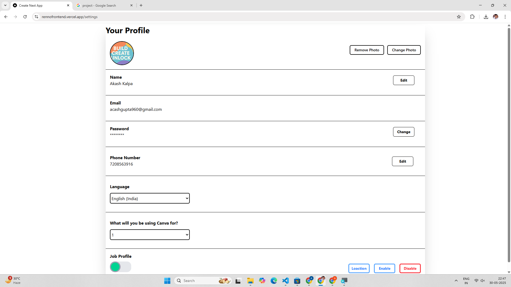

# Rennotar

**Renovator** is a Full-Stack, End-to-End Project Management tool that helps you manage almost all aspects of renovation projects efficiently. Whether you are a contractor, designer, or service provider, Renovator brings all your project workflows into one platform.

### 📸 Screenshots






### 🧩 Tech Stack  
Frontend: Next.js 14, TypeScript, Tailwind, Shadcn, OAuth  
Backend: Node.js, GCP ,Graphql,Express  
Database: PostgreSQL 15, MongoDB, Redis
Cloud & Storage: GCP  
Email Notifications: Gmail SMTP, Twilio


## ✨ Features

- **Project Management**: Create, track, and manage renovation projects
- **Team Collaboration**: Real-time communication and task assignment
- **Client Management**: Customer profiles, communication, and project updates
- **Become a E-Commerce Seller** : Well Organized Marketplace with already strong userbase
- **Hire and Get Job** : Hire and Find Jobs around you with no extra commission
- **Financial Tracking**: Budget management, invoicing, and payment processing
- **Inventory Management**: Track materials, suppliers, and stock levels
- **Document Management**: Store and organize project documents
- **Real-time Notifications**: Stay updated with project progress
- **Mobile Responsive**: Access from any device


⚙️ ENV VARIABLES FOR FRONTEND


```env 

NEXT_PUBLIC_Endpoint=Your_Endpoint
MONGODB_URI=Your_MongoDB_URI
NEXT_PUBLIC_Socket_URL=Your_Socket_URL
NEXT_PUBLIC_GOOGLE_API_KEY=Your_Google_API_Key


```


🛠️ ENV VARIABLES FOR BACKEND


```env 

DATABASE_URL=Your_Postgres_URL
MONGO_URI=Your_MongoDB_URI
JWT_SECRET=Your_JWT_Secret
BUCKET_NAME=Your_Bucket_Name
NODE_ENV=development
PROJECT_ID=Your_Project_ID
GCP_FILE=Your_GCP_File
Email=Your_Email
Password=Your_Email_Password
PHONE_NUM=Your_Phone_Number
PORT=3000


```

## Set Up Guide 

#### Make sure you configured all above mentioned .env and .env variables perfectly 
```bash

cd frontend 
npm install next 
npm run dev 
# For production
npm run build
npm start

cd backend 
npm install 
npm start

```

### Setup and Run with Docker 
Setting up and running with Docker [Docker Guide](./Docker.md).


## 📘 Contribution Guide

To learn how to contribute, please check the [Contribution Guide](./CONTRIBUTION.md).

---


## 🌐 Live Demo

[Live View](https://rennofrontend.vercel.app/)

---


# SHOW YOUR SUPPORT
Dont forget to give a ⭐️ to this project ... Happy coding!


